# 🍱 Dinner Order — 저녁식사 신청 시스템

매일 저녁 어떤 식당에서 무엇을 먹을지, 누가 신청했는지를 한눈에 관리하는 사내용 저녁식사 신청/취합 웹 서비스입니다.
직원은 이름만 검색해서 메뉴를 신청하고, 관리자는 오늘의 식당을 고르고 신청 현황을 실시간으로 취합·복사할 수 있습니다.

<p align="left">
  
  
  
  
  
  
  
</p>

---

## 📖 목차

- [소개](#-소개)
- [데모](#-데모)
- [주요 기능](#-주요-기능)
- [기술 스택](#-기술-스택)
- [프로젝트 구조](#-프로젝트-구조)
- [시작하기](#-시작하기)
- [라이선스](#-라이선스)

---

## 💡 소개

매일 오후 5시~6시, 정해진 시간 동안만 신청을 받는 사내 저녁식사 신청 시스템입니다.

- **직원**은 로그인 후 본인 이름을 선택하고, 오늘 운영하는 식당 중 하나를 골라 메뉴를 신청합니다.
- **관리자**는 오늘의 식당(최대 5개 카테고리: 한식/양식/샐러드/햄버거/일식)을 미리 지정하고, 실시간으로 들어오는 신청을 취합해 카카오톡/슬랙 등에 바로 붙여넣을 수 있는 텍스트로 복사합니다.
- 같은 사람이 두 번 신청하면 자동으로 "이미 신청하셨습니다" 안내와 함께 기존 신청을 수정할지 물어봐 중복 신청을 방지합니다.
- 지난 신청 내역은 기간·직원·식당별로 조회하고, 인기 메뉴/인기 식당 TOP 5 통계도 함께 확인할 수 있습니다.

## 🎬 데모

실제 신청 화면에서 식당·메뉴를 고르고 제출하면, 이미 신청한 내역이 있는 경우 자동으로 중복 확인 팝업이 뜨는 흐름입니다.

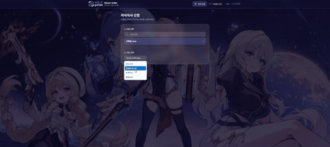

## ✨ 주요 기능

### 로그인 & 회원가입

아이디/비밀번호로 로그인하며, 회원가입 시에는 등록된 직원 닉네임 목록 중에서 하나를 선택해 계정을 만드는 방식입니다.

<table>
<tr>
<td width="50%">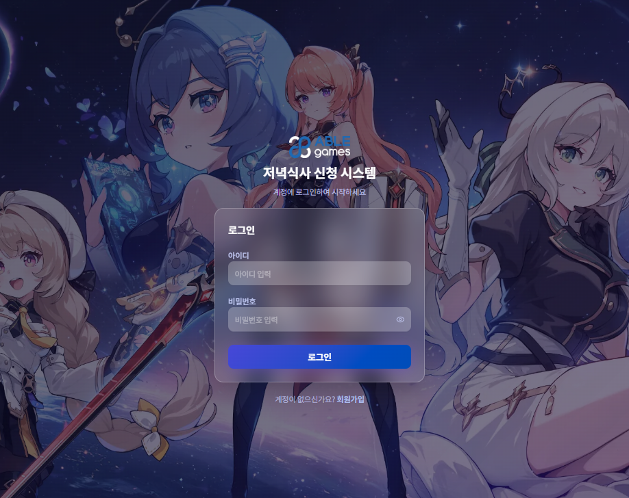</td>
<td width="50%">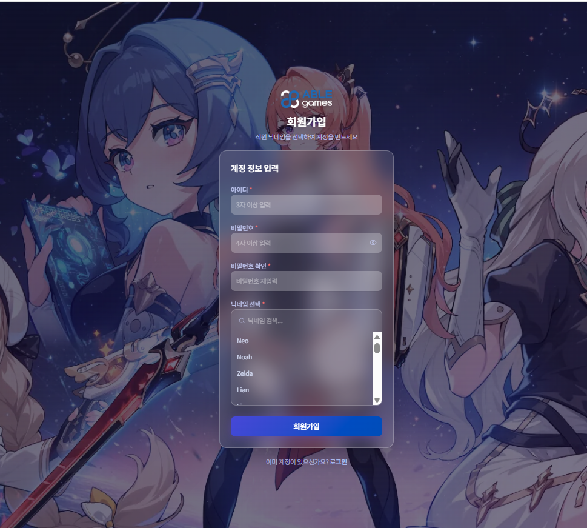</td>
</tr>
<tr>
<td align="center">로그인</td>
<td align="center">회원가입 (닉네임 선택형)</td>
</tr>
</table>

### 저녁식사 신청 (직원)

이름 검색 → 식당 선택 → 메인/사이드/음료/추가 옵션 선택 순서로 3단계면 신청이 끝납니다. 이미 신청 내역이 있으면 수정 여부를 다시 확인합니다.

<table>
<tr>
<td width="50%">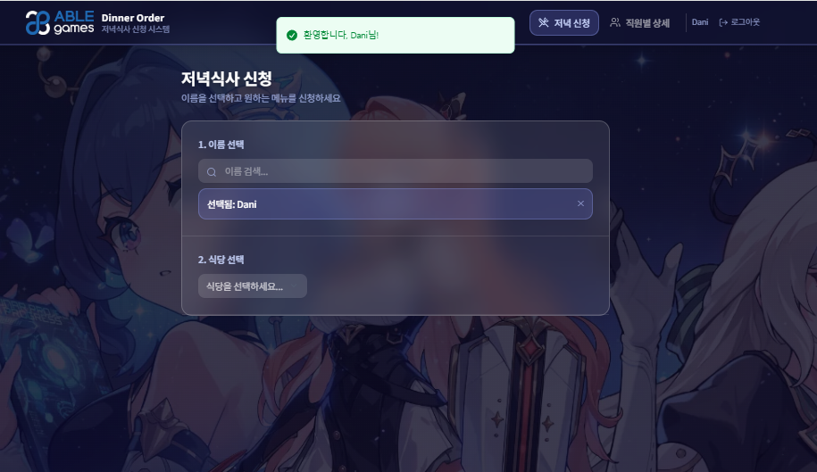</td>
<td width="50%">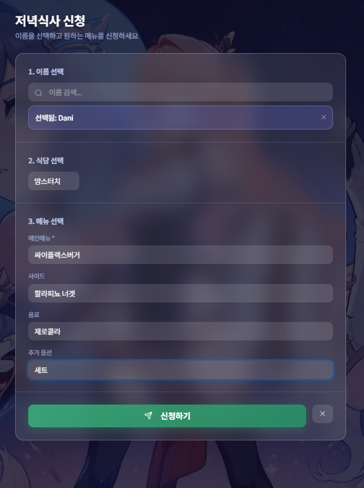</td>
</tr>
<tr>
<td align="center">1. 이름 · 식당 선택</td>
<td align="center">2. 메뉴 옵션 선택 후 신청</td>
</tr>
</table>

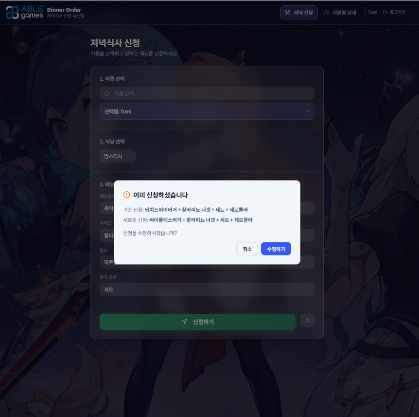
<p><em>중복 신청 시 기존 신청 내역을 보여주고 수정 여부를 확인합니다.</em></p>

### 홈 대시보드

로그인 후 오늘의 식당 설정 여부와 현재까지 신청 인원을 한눈에 보여주고, 권한에 따라 신청/관리자/취합 메뉴로 바로 이동할 수 있습니다.

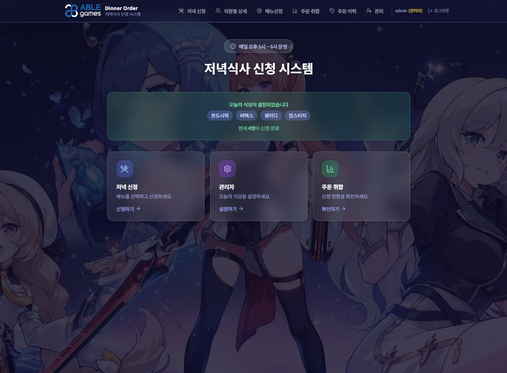

### 관리자 기능

| 화면 | 설명 |
| --- | --- |
| 오늘의 식당 설정 | 카테고리(한식/양식/샐러드/햄버거/일식)별로 등록된 식당 중 오늘 운영할 곳을 선택하고, 신청 마감 처리도 가능합니다. |
| 주문 취합 | 총 신청 인원, 오늘의 식당 수, 식당별 주문, 음료 수량 등을 실시간으로 집계하고 카카오톡/슬랙 공유용 텍스트로 한 번에 복사합니다. |
| 주문 이력 조회 | 기간·직원·식당 필터로 지난 신청 내역을 조회하고, 인기 메뉴·인기 식당 TOP 5 통계를 확인합니다. |
| 직원 관리 | 신청 가능한 직원(닉네임) 목록을 추가·삭제합니다. |
| 식당 & 메뉴 관리 | 식당과 각 식당의 메인/사이드/음료/드레싱/추가옵션 메뉴를 추가·수정·삭제합니다. |
| 계정 관리 | 가입된 전체 계정을 확인하고 관리자 권한을 부여하거나 계정을 삭제합니다. |
| 직원별 상세 조회 | 오늘 누가 어떤 메뉴를 신청했는지 이름으로 검색해 바로 확인합니다. |

<table>
<tr>
<td width="50%">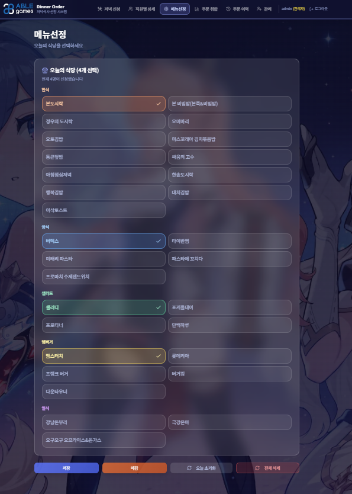</td>
<td width="50%">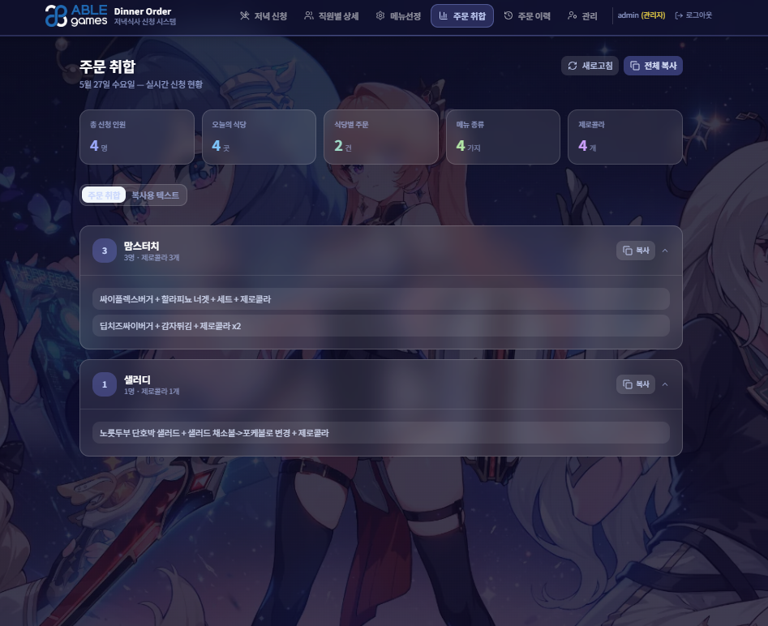</td>
</tr>
<tr>
<td align="center">오늘의 식당 설정</td>
<td align="center">주문 취합 (실시간 집계 + 복사)</td>
</tr>
<tr>
<td width="50%">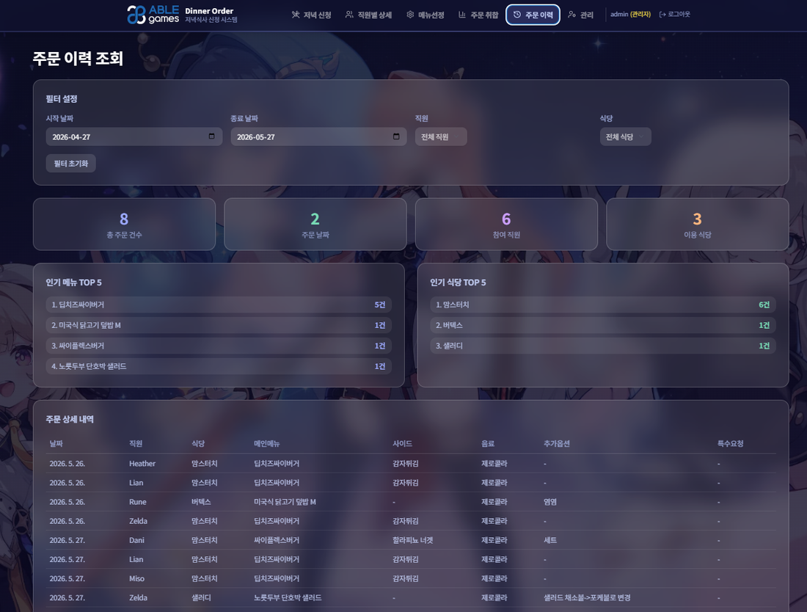</td>
<td width="50%">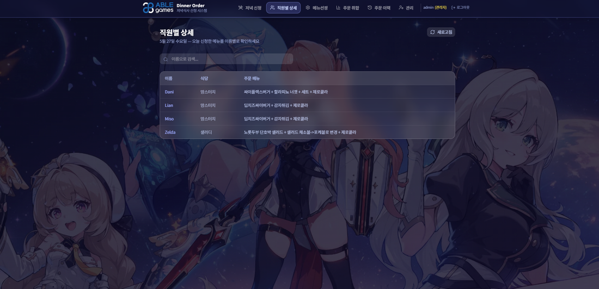</td>
</tr>
<tr>
<td align="center">주문 이력 조회 & 통계</td>
<td align="center">직원별 상세 조회</td>
</tr>
<tr>
<td width="50%">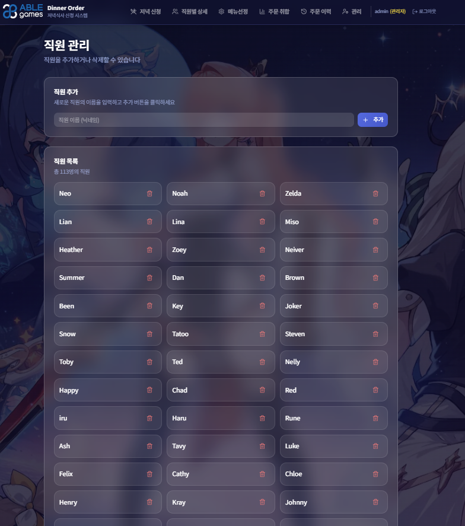</td>
<td width="50%">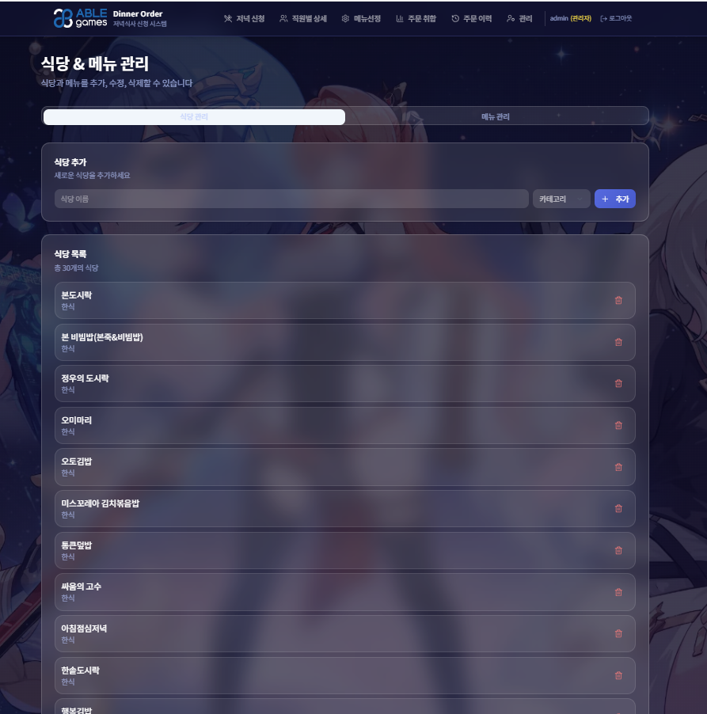</td>
</tr>
<tr>
<td align="center">직원 관리</td>
<td align="center">식당 & 메뉴 관리</td>
</tr>
</table>

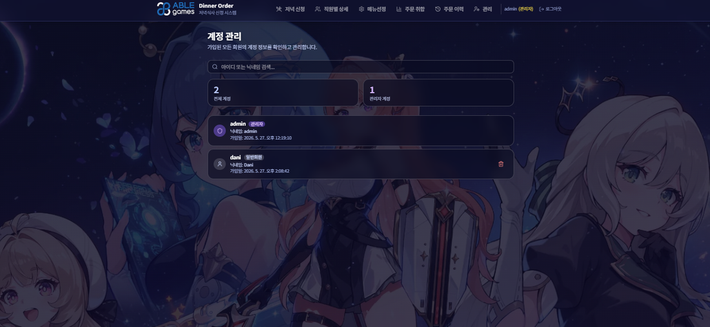
<p align="center"><em>계정 관리 — 가입 계정 및 권한 확인</em></p>

## 🛠 기술 스택

| 구분 | 사용 기술 |
| --- | --- |
| Frontend | React 19, TypeScript, Vite, TailwindCSS 4, shadcn/ui (Radix UI), TanStack Query, React Hook Form, Zod, Wouter |
| Backend | Node.js, Express 4, tRPC 11 (End-to-end type-safe API) |
| Database | MySQL, Drizzle ORM |
| Auth | 자체 아이디/비밀번호 인증, JWT 세션 쿠키 (jose) |
| Testing | Vitest |
| Tooling | pnpm, ESBuild, Prettier |

## 📁 프로젝트 구조

```
client/
  src/
    pages/        # 화면 단위 컴포넌트 (신청, 관리자, 취합, 이력 등)
    components/    # 공통 UI 컴포넌트 (레이아웃, shadcn/ui 등)
    contexts/      # 인증 상태 등 전역 컨텍스트
    lib/trpc.ts    # tRPC 클라이언트
server/
  db.ts            # DB 쿼리 헬퍼
  routers.ts       # tRPC 라우터 (auth / restaurant / employee / daily / order)
drizzle/
  schema.ts        # DB 테이블 스키마 (식당, 메뉴, 직원, 일일설정, 주문, 계정)
shared/            # 프론트/백엔드 공용 유틸 (메뉴 표기 포맷 등)
docs/              # README용 스크린샷 · 데모 이미지
```

## 🚀 시작하기

```bash
# 1. 의존성 설치
pnpm install

# 2. 환경 변수 설정 (.env)
#    DATABASE_URL, JWT_SECRET 등 필요한 값을 설정하세요.

# 3. DB 스키마 반영
pnpm db:push

# 4. 개발 서버 실행
pnpm dev

# 테스트 실행
pnpm test
```

## 📄 라이선스

MIT License
